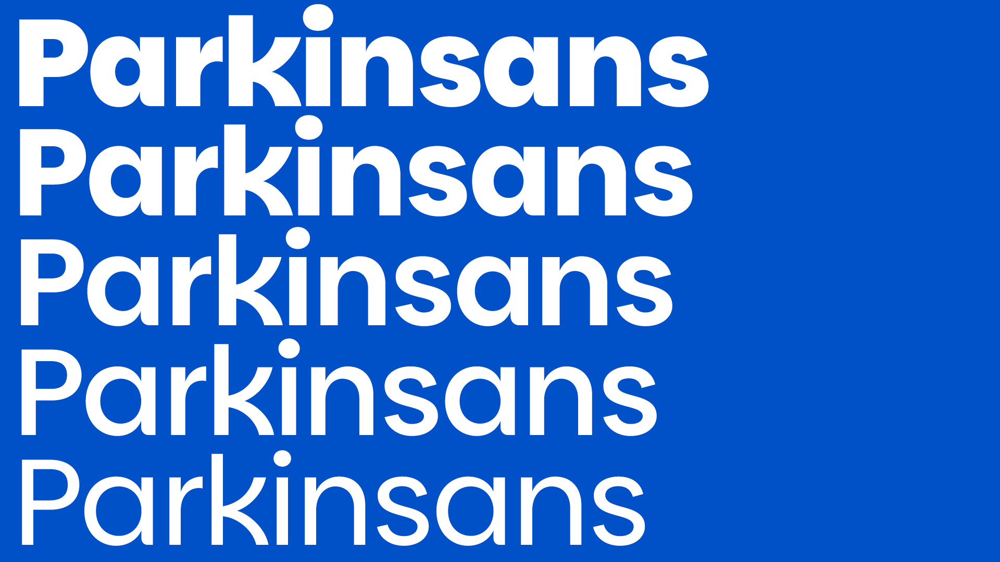
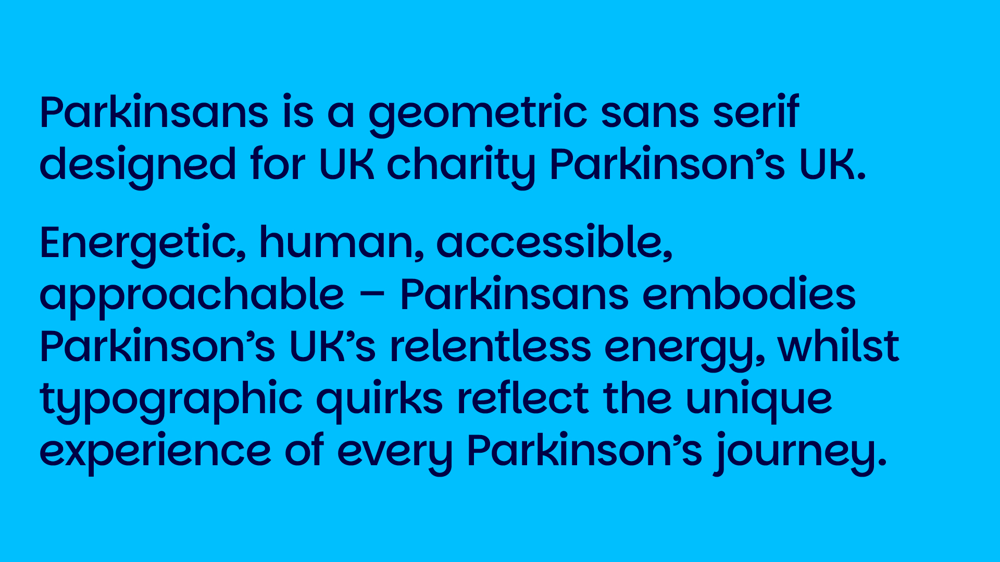
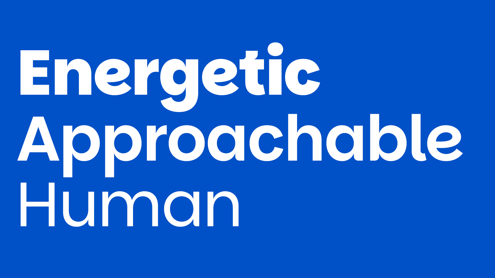
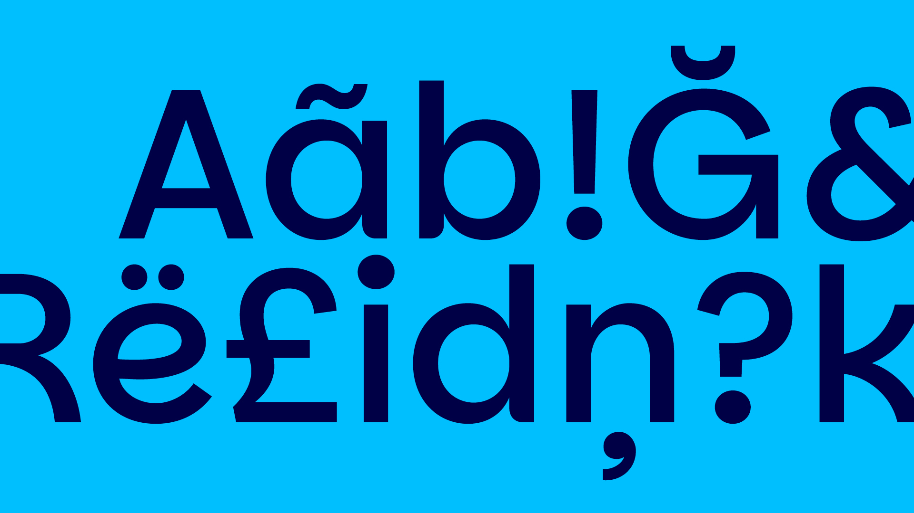

# Parkinsans

[![][Fontbakery]](https://redstonedesign.github.io/parkinsans/fontbakery/fontbakery-report.html)

[Fontbakery]: https://img.shields.io/endpoint?url=https%3A%2F%2Fraw.githubusercontent.com%2Fgooglefonts%2Fgooglefonts-project-template%2Fgh-pages%2Fbadges%2Foverall.json

Parkinsans is a geometric sans serif designed for UK charity Parkinson’s UK.

Energetic, human, accessible, approachable – Parkinsans embodies Parkinson’s UK’s relentless energy, whilst typographic quirks reflect the unique experience of every Parkinson’s journey.

Consisting of 6 weights, Parkinsans is designed to grab attention at display sizes and provide an accessible, easy reading experience for short form copy.

Designed by award-winning, London based creative agency Red Stone, Parkinsans is a fork of from Indian Type Foundry's [Poppins](https://fonts.google.com/specimen/Poppins).

## About

Red Stone is an award-winning creative agency based in East London. We partner with ambitious and courageous organisations looking to make a positive change to the world.

## Building

Fonts are built automatically by GitHub Actions - take a look in the "Actions" tab for the latest build.

If you want to build fonts manually on your own computer:

* `make build` will produce font files.
* `make test` will run [FontBakery](https://github.com/googlefonts/fontbakery)'s quality assurance tests.
* `make proof` will generate HTML proof files.

The proof files and QA tests are also available automatically via GitHub Actions - look at `https://github.com/redstonedesign/parkinsans`.

## Changelog

**03 Oct 2024. Version 1.0**
- Parkinsans Git repo created.
- Parkinsans files added to Git repo.

## License

This Font Software is licensed under the SIL Open Font License, Version 1.1.
This license is available with a FAQ at
https://scripts.sil.org/OFL

## Repository Layout

This font repository structure is inspired by [Unified Font Repository v0.3](https://github.com/unified-font-repository/Unified-Font-Repository), modified for the Google Fonts workflow.
